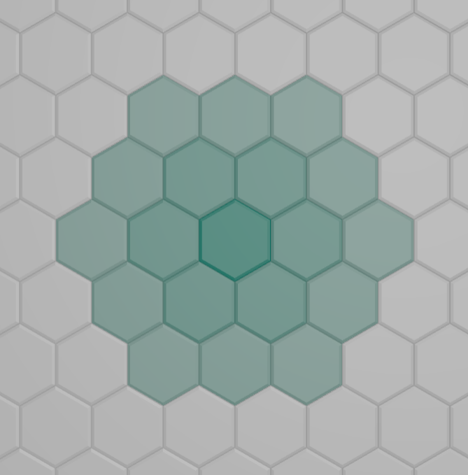

# Hexagon map
Realtime web game based on an hexagonal map. See rules of the game below.

This game is a personnal experiment to see how far I could get using Rust, Redis
and websockets to handle as much as possible load on a server.

This is far from being usable in production so please don't. It's not properly
secured with a real auth mechanism and is far from being bulletproof concerning
performance and bugs.

## Prequisite
You must have docker and nodejs/npm to run the app.

## How to run
```bash
git clone https://github.com/pbellon/hexgon-map.git
cd hexagon-map
./run.sh up &
cd frontend
npm install && npm run dev &

# And if you want to launch the stress-test
cd ..
./run.sh stress-test
```

## General game rules
This game is inspired by Reddit's place game but instead of pixel we use an
hexagonal tiles map and the rules of tile ownership are more complex that Reddit
place. 

When a tile gets owned by a player, it received a strength of 1, meaning that it
would require one click to be owned by another player. You can increase your own
tiles strength by owning tiles in the neighborhood of a tile (up to a distance
of two).



If another player click on a tile owned by a user it will "damages" it by
reducing its strength. Once the strength reach 0, the tile will change ownership
and update the strength of surrounding tiles (owned or not by the new owner).

You can counter those damages by clicking on previously damaged tile, this will
"repair" the tile until you reach its maximum theory strength deducted by the
number of surrounding tiles up to a distance of two like shown above.

## Resources

- Red blob games incredible hexagons articles https://www.redblobgames.com/grids/hexagons/#coordinates
- https://discourse.threejs.org/t/hexagonal-grid-formation/18396
- https://github.com/vonWolfehaus/von-grid?tab=readme-ov-file
